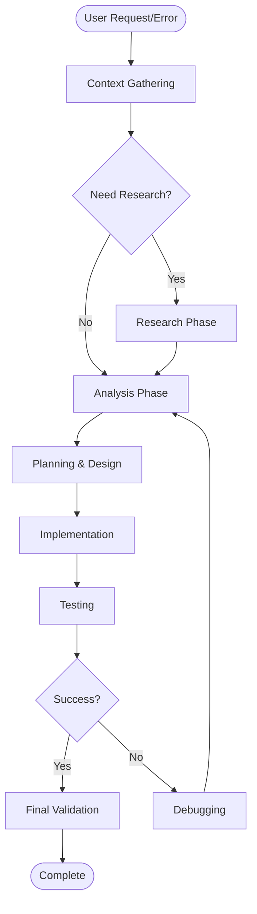

# 🔄 Development Cycle Analysis

**Analysis Date**: 2025-10-11 11:12:52

**Source**: copilot.md

---

## 📊 Executive Summary

- **Total Workflow Phases**: 1233
- **Total Iteration Cycles**: 369
- **Common Tool Sequences**: 199

### Phase Distribution

- **testing**: 396 occurrences (32.1%)
- **debugging**: 322 occurrences (26.1%)
- **research**: 220 occurrences (17.8%)
- **context_gathering**: 162 occurrences (13.1%)
- **analysis**: 103 occurrences (8.4%)
- **implementation**: 30 occurrences (2.4%)

### Success Rate: 75.1%

- **Successful Cycles**: 277
- **Failed Cycles**: 92

### Average Iterations per Cycle: 1.8

---

## 🔄 Workflow Phases

### Phase #1: Testing

- **Lines**: 3 - 70 (68 lines)
- **Outcome**: success
- **Key Actions**:
  - ## 🎉 VALIDATION SYSTEM READY FOR QUICK TEST...
  - - ✅ 36 tests passing (16 SimulationRunner + 20 Environment)...
  - **Quick Test Mode:**...

### Phase #2: Debugging

- **Lines**: 71 - 75 (5 lines)
- **Outcome**: success
- **Key Actions**:
  - - ✅ Environment initializes without errors...
  - **If something fails:**...

### Phase #3: Testing

- **Lines**: 76 - 93 (18 lines)
- **Outcome**: success
- **Key Actions**:
  - - Quick test uses only 15 min of your 30h quota...
  - - Fix issues and re-run quick test...
  - - Don't run full test until quick test passes!...

### Phase #4: Research

- **Lines**: 94 - 95 (2 lines)
- **Outcome**: unknown
- **Key Actions**:
  - ### 📖 Documentation...

### Phase #5: Testing

- **Lines**: 96 - 99 (4 lines)
- **Outcome**: unknown
- **Key Actions**:
  - **Quick Test Guide:** QUICK_TEST_GUIDE.md...
  - - How to run quick test...
  - - What it validates...

### Phase #6: Debugging

- **Lines**: 100 - 100 (1 lines)
- **Outcome**: unknown
- **Key Actions**:
  - - Debugging tips...

### Phase #7: Testing

- **Lines**: 101 - 122 (22 lines)
- **Outcome**: success
- **Tools Used**: read_file
- **Key Actions**:
  - - Next steps after quick test...
  - Your RL-ARZ direct coupling with GPU acceleration is **fully implemented and rea...
  - **Run the quick test and let me know the results!** 🚀...

### Phase #8: Context Gathering

- **Lines**: 123 - 124 (2 lines)
- **Outcome**: unknown
- **Tools Used**: grep_search
- **Key Actions**:
  - Now let me check the ValidationKaggleManager to verify it has the same results d...

### Phase #9: Research

- **Lines**: 125 - 130 (6 lines)
- **Outcome**: unknown
- **Tools Used**: read_file
- **Key Actions**:
  - Searched text for `download.*results|validation_results|session_summary` (`**/va...

### Phase #10: Testing

- **Lines**: 131 - 132 (2 lines)
- **Outcome**: success
- **Tools Used**: grep_search
- **Key Actions**:
  - Perfect! The ValidationKaggleManager has the same download logic as Section 7.4....

### Phase #11: Research

- **Lines**: 133 - 134 (2 lines)
- **Outcome**: unknown
- **Tools Used**: read_file
- **Key Actions**:
  - Searched text for `validation_results|session_summary|save.*figures|latex` (`**/...

### Phase #12: Testing

- **Lines**: 135 - 140 (6 lines)
- **Outcome**: unknown
- **Tools Used**: read_file
- **Key Actions**:
  - Read [](file:///d%3A/Projets/Alibi/Code%20project/validation_ch7/scripts/test_se...
  - Read [](file:///d%3A/Projets/Alibi/Code%20project/validation_ch7/scripts/test_se...

### Phase #13: Context Gathering

- **Lines**: 141 - 142 (2 lines)
- **Outcome**: unknown
- **Tools Used**: grep_search
- **Key Actions**:
  - Now let me check where session_summary.json is created:...

### Phase #14: Research

- **Lines**: 143 - 146 (4 lines)
- **Outcome**: unknown
- **Key Actions**:
  - Searched text for `session_summary|write_session_summary|create_session_summary`...

### Phase #15: Context Gathering

- **Lines**: 147 - 148 (2 lines)
- **Outcome**: unknown
- **Tools Used**: grep_search
- **Key Actions**:
  - Let me check the ValidationSection base class:...

### Phase #16: Research

- **Lines**: 149 - 154 (6 lines)
- **Outcome**: unknown
- **Tools Used**: read_file
- **Key Actions**:
  - Searched text for `session_summary|write_summary` (`**/validation_ch7/scripts/va...

### Phase #17: Context Gathering

- **Lines**: 155 - 156 (2 lines)
- **Outcome**: success
- **Tools Used**: grep_search
- **Key Actions**:
  - Perfect! Now let me check if the test script calls save_session_summary:...

### Phase #18: Research

- **Lines**: 157 - 160 (4 lines)
- **Outcome**: unknown
- **Key Actions**:
  - Searched text for `save_session_summary` (`**/validation_ch7/scripts/test_sectio...

### Phase #19: Context Gathering

- **Lines**: 161 - 162 (2 lines)
- **Outcome**: unknown
- **Tools Used**: read_file
- **Key Actions**:
  - I need to add the session_summary call to the test script. Let me check the end ...

### Phase #20: Testing

- **Lines**: 163 - 166 (4 lines)
- **Outcome**: unknown
- **Key Actions**:
  - Read [](file:///d%3A/Projets/Alibi/Code%20project/validation_ch7/scripts/test_se...

---

## 🔁 Iteration Cycles

### Cycle #1

- **Lines**: 0 - 127
- **Iterations**: 1
- **Final Outcome**: success
- **Phases**: 9
- **Tool Sequence**: read_file → grep_search → read_file

**Key Decisions**:
- let me know the results!** 🚀
- let me check the ValidationKaggleManager to verify it has the same results download logic as Section 7.4:

---

### Cycle #2

- **Lines**: 128 - 133
- **Iterations**: 1
- **Final Outcome**: success
- **Phases**: 2
- **Tool Sequence**: grep_search

**Key Decisions**:
- Let me verify the test script generates the correct output structure:

---

### Cycle #3

- **Lines**: 134 - 151
- **Iterations**: 2
- **Final Outcome**: success
- **Phases**: 5
- **Tool Sequence**: read_file → read_file → grep_search → grep_search → read_file

**Key Decisions**:
- let me check where session_summary.json is created:
- Let me check the ValidationSection base class:

---

### Cycle #4

- **Lines**: 152 - 157
- **Iterations**: 1
- **Final Outcome**: success
- **Phases**: 2
- **Tool Sequence**: grep_search

**Key Decisions**:
- let me check if the test script calls save_session_summary:

---

### Cycle #5

- **Lines**: 158 - 169
- **Iterations**: 1
- **Final Outcome**: success
- **Phases**: 4
- **Tool Sequence**: read_file → read_file

**Key Decisions**:
- I need to add the session_summary call to the test script. Let me check the end of the main function:
- Let me check the end of the main function:
- I need to add the save_session_summary call. Let me check what run_all_tests returns:

---

### Cycle #6

- **Lines**: 170 - 175
- **Iterations**: 1
- **Final Outcome**: success
- **Phases**: 1
- **Tool Sequence**: replace_string

**Key Decisions**:
- I need to add the save_session_summary call before returning. Let me update the run_all_tests method:
- Let me update the run_all_tests method:

---

### Cycle #7

- **Lines**: 176 - 185
- **Iterations**: 1
- **Final Outcome**: success
- **Phases**: 1
- **Tool Sequence**: run_terminal

**Key Decisions**:
- let me commit this critical fix and launch the quick test:

---

### Cycle #8

- **Lines**: 186 - 191
- **Iterations**: 1
- **Final Outcome**: success
- **Phases**: 0
- **Tool Sequence**: run_terminal

**Key Decisions**:
- let me launch the quick test and monitor it until completion:

---

### Cycle #9

- **Lines**: 192 - 209
- **Iterations**: 1
- **Final Outcome**: success
- **Phases**: 2
- **Tool Sequence**: run_terminal

**Key Decisions**:
- Let me check the full terminal output:
- Let me continue monitoring:
- Let me wait a bit and then check for progress:

---

### Cycle #10

- **Lines**: 210 - 239
- **Iterations**: 1
- **Final Outcome**: failure
- **Phases**: 3
- **Tool Sequence**: run_terminal → run_terminal

**Key Decisions**:
- let me check the terminal output again to see the monitoring progress:
- Let me verify the results were downloaded correctly:
- Let me check the session summary to see what happened:

---

## 🔗 Common Tool Sequences

These are the most frequent tool call patterns:

### Pattern #1 (Used 316 times)

**Sequence**: run_terminal → run_terminal

**Typical Outcome**: success

**Context**: _session_summary call before returning. Let me update the run_all_tests method: 

Using "Replace Str...

---

### Pattern #2 (Used 233 times)

**Sequence**: run_terminal → run_terminal → run_terminal

**Typical Outcome**: success

**Context**: _session_summary call before returning. Let me update the run_all_tests method: 

Using "Replace Str...

---

### Pattern #3 (Used 176 times)

**Sequence**: run_terminal → run_terminal → run_terminal → run_terminal

**Typical Outcome**: success

**Context**: _session_summary call before returning. Let me update the run_all_tests method: 

Using "Replace Str...

---

### Pattern #4 (Used 97 times)

**Sequence**: read_file → replace_string

**Typical Outcome**: success

**Context**: libi/Code%20project/validation_ch7/scripts/test_section_7_6_rl_performance.py#750-750), lines 750 to...

---

### Pattern #5 (Used 96 times)

**Sequence**: grep_search → read_file

**Typical Outcome**: success

**Context**: ect/validation_ch7/scripts/run_kaggle_validation_section_7_6.py#1-1), lines 1 to 100


Now let me c...

---

### Pattern #6 (Used 89 times)

**Sequence**: read_file → read_file

**Typical Outcome**: success

**Context**: ript generates the correct output structure: 

Searched text for `validation_results|session_summary...

---

### Pattern #7 (Used 77 times)

**Sequence**: read_file → grep_search

**Typical Outcome**: success

**Context**: ...
If yes launch command and wait until it finished and download results.... 

GitHub Copilot: I'll...

---

### Pattern #8 (Used 66 times)

**Sequence**: replace_string → replace_string

**Typical Outcome**: unknown

**Context**: er.py#760-760), lines 760 to 790


Now I can see the issue. The line `U_obs = self.d_U[:, segment_i...

---

### Pattern #9 (Used 64 times)

**Sequence**: replace_string → run_terminal

**Typical Outcome**: success

**Context**: ation_ch7/scripts/test_section_7_6_rl_performance.py#480-480), lines 480 to 550


Perfect! Now I ne...

---

### Pattern #10 (Used 56 times)

**Sequence**: run_terminal → read_file

**Typical Outcome**: success

**Context**: ro\validation_results\session_summary.json"


I see the issue - the session_summary.json was create...

---

### Pattern #11 (Used 52 times)

**Sequence**: replace_string → run_terminal → run_terminal

**Typical Outcome**: success

**Context**: ation_ch7/scripts/test_section_7_6_rl_performance.py#480-480), lines 480 to 550


Perfect! Now I ne...

---

### Pattern #12 (Used 49 times)

**Sequence**: read_file → grep_search → read_file

**Typical Outcome**: success

**Context**: ...
If yes launch command and wait until it finished and download results.... 

GitHub Copilot: I'll...

---

### Pattern #13 (Used 46 times)

**Sequence**: replace_string → read_file

**Typical Outcome**: success

**Context**: ibi/Code%20project/validation_ch7/scripts/test_section_7_6_rl_performance.py#180-180), lines 180 to ...

---

### Pattern #14 (Used 45 times)

**Sequence**: grep_search → grep_search

**Typical Outcome**: unknown

**Context**: to 80

Read [](file:///d%3A/Projets/Alibi/Code%20project/validation_ch7/scripts/test_section_7_6_rl_...

---

### Pattern #15 (Used 43 times)

**Sequence**: run_terminal → run_terminal → read_file

**Typical Outcome**: success

**Context**: 
Read [](file:///d%3A/Projets/Alibi/Code%20project/validation_output/results/elonmj_arz-validation-7...

---

## 📋 Formalized Development Cycle

Based on the analysis, here is the recommended development cycle:

```
DEVELOPMENT_CYCLE = {
    'phases': [
        'testing',  # Occurs 396 times
        'debugging',  # Occurs 322 times
        'research',  # Occurs 220 times
        'context_gathering',  # Occurs 162 times
        'analysis',  # Occurs 103 times
        'implementation',  # Occurs 30 times
    ],

    'typical_tool_sequence': [
        'run_terminal',
        'run_terminal',
    ],

    'average_iterations': 1.8,
    'success_rate': 75.1,

    'best_practices': [
        'Always gather context before implementing',
        'Test after each significant change',
        'Commit working code before major refactors',
        'Use quick tests before full validation',
        'Document decisions and reasoning',
    ]
}
```

## 🌊 Workflow Diagram



---

## 🎯 Recommendations

1. **Context First**: Always gather context before implementation
2. **Iterate Smart**: Average 2 iterations is normal, don't give up
3. **Test Early**: Run tests after each significant change
4. **Use Patterns**: Leverage common tool sequences for efficiency
5. **Learn from Failures**: 92 failed cycles provide learning opportunities
