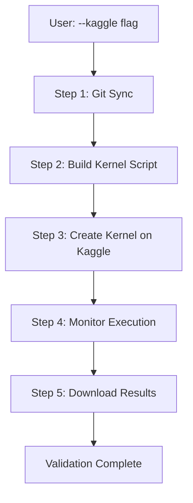

# 🌐 Kaggle GPU Execution Guide

## Overview

The Section 7.6 validation system now supports **remote GPU execution on Kaggle** with clean architecture and automatic workflow management.

### Architecture Highlights

✅ **Clean DDD Architecture** - 4 separate modules following SOLID principles
✅ **Auto Git Sync** - Automatically commits and pushes changes before execution
✅ **Kernel Script Generation** - Auto-generates complete Kaggle execution scripts
✅ **Execution Monitoring** - Polls kernel status until completion
✅ **Results Download** - Auto-downloads validation results

## Quick Start

### Prerequisites

1. **Kaggle Account & API Credentials**
   ```bash
   # Download kaggle.json from https://www.kaggle.com/settings
   # Place at: ~/.kaggle/kaggle.json (Linux/Mac) or %USERPROFILE%\.kaggle\kaggle.json (Windows)
   ```

2. **Git Configuration**
   ```bash
   git config --global user.name "Your Name"
   git config --global user.email "your.email@example.com"
   ```

3. **GitHub Repository Access**
   - Ensure your repository is public OR you have SSH keys configured
   - Kaggle will clone from GitHub (not local files)

### Basic Usage

#### 1. Quick Test on Kaggle GPU (5 timesteps)
```bash
python entry_points/cli.py run --kaggle --quick-test
```

#### 2. Full Validation on Kaggle GPU
```bash
python entry_points/cli.py run --kaggle
```

#### 3. Specific Algorithm
```bash
python entry_points/cli.py run --kaggle --algorithm ppo --quick-test
```

#### 4. CPU Execution (for testing)
```bash
python entry_points/cli.py run --kaggle --device cpu --quick-test
```

## Architecture

### Module Structure

```
infrastructure/kaggle/
├── __init__.py                 # Module exports
├── kaggle_client.py            # Kaggle API wrapper (SRP: API communication)
├── git_sync_service.py         # Git operations (SRP: version control)
├── kaggle_kernel_builder.py    # Script generation (SRP: script building)
└── kaggle_orchestrator.py      # Workflow coordination (SRP: orchestration)
```

### Workflow (5 Steps)



### Components

#### 1. **KaggleClient** (`kaggle_client.py`)
**Responsibility**: Kaggle API communication
```python
client = KaggleClient(credentials_path="~/.kaggle/kaggle.json")
client.create_kernel(slug="my-kernel", script=script_content, gpu_enabled=True)
status = client.monitor_kernel(slug="my-kernel", timeout=3600)
client.download_kernel_output(slug="my-kernel", output_dir="./results")
```

#### 2. **GitSyncService** (`git_sync_service.py`)
**Responsibility**: Git synchronization
```python
git_service = GitSyncService(repo_path=".")
git_service.ensure_up_to_date(
    commit_message="Auto-commit: validation run",
    auto_stage=True
)
```

**Why Critical**: Kaggle clones from GitHub, not local files!

#### 3. **KaggleKernelBuilder** (`kaggle_kernel_builder.py`)
**Responsibility**: Generate Kaggle execution scripts
```python
builder = KaggleKernelBuilder()
script = builder.build_validation_script(
    repo_url="https://github.com/elonmj/Code-traffic-flow",
    branch="main",
    script_path="validation_ch7_v2/scripts/niveau4_rl_performance/run_section_7_6.py",
    quick_mode=True,
    device="gpu"
)
```

Generated script includes:
- Repository cloning
- Validation execution
- Results preservation
- Cleanup (saves Kaggle disk space)
- Session completion markers

#### 4. **KaggleOrchestrator** (`kaggle_orchestrator.py`)
**Responsibility**: End-to-end workflow coordination
```python
orchestrator = KaggleOrchestrator()
result = orchestrator.execute_validation(
    validation_name="section-7-6-quick",
    script_path="validation_ch7_v2/scripts/niveau4_rl_performance/run_section_7_6.py",
    quick_mode=True,
    device="gpu",
    auto_sync_git=True
)
```

## Detailed Workflow

### Step 1: Git Synchronization
```
📦 Checking Git status...
   - Staged files: 0
   - Unstaged files: 2
   - Untracked files: 1

📦 Auto-staging all changes...
   ✅ git add -A

📦 Committing changes...
   ✅ git commit -m "Auto-commit: Section 7.6 validation"

📦 Pushing to remote...
   ✅ git push origin main
```

### Step 2: Kernel Script Generation
```
🔨 Building kernel script...
   Repository: https://github.com/elonmj/Code-traffic-flow
   Branch: main
   Script: validation_ch7_v2/scripts/niveau4_rl_performance/run_section_7_6.py
   Quick mode: True
   Device: GPU

   ✅ Script generated (850 lines)
```

### Step 3: Kernel Creation
```
🚀 Creating kernel on Kaggle...
   Kernel slug: section-7-6-quick-20251020-113000
   GPU enabled: True
   Internet access: False

   ✅ Kernel created and pushed
```

### Step 4: Execution Monitoring
```
⏳ Monitoring kernel execution...
   [00:00] Status: queued
   [00:30] Status: running
   [15:00] Status: running (GPU training in progress)
   [25:30] Status: complete
   [25:30] ✅ SESSION_COMPLETE marker detected

   ✅ Execution completed successfully
```

### Step 5: Results Download
```
📥 Downloading results...
   Output directory: ./kaggle_results/section-7-6-quick-20251020-113000/

   Files downloaded:
   ✅ validation_results/training_metrics.json
   ✅ validation_results/evaluation_results.json
   ✅ validation_results/plots/training_curve.png
   ✅ session_summary.json

   ✅ All results downloaded
```

## Configuration

### Environment Variables (Optional)
```bash
# Custom Kaggle credentials path
export KAGGLE_CONFIG_DIR=~/my-kaggle-config

# Custom Git repository
export REPO_URL=https://github.com/yourusername/your-repo

# Custom branch
export GIT_BRANCH=develop
```

### Advanced Usage

#### Custom Commit Message
The orchestrator automatically generates commit messages, but you can customize:
```python
result = orchestrator.execute_validation(
    validation_name="my-test",
    script_path="...",
    commit_message="Custom commit: experimental validation run"
)
```

#### Extended Timeout
For longer validations:
```python
result = orchestrator.execute_validation(
    validation_name="full-validation",
    script_path="...",
    monitor_timeout=14400  # 4 hours
)
```

#### Skip Git Sync
If you've already committed manually:
```python
result = orchestrator.execute_validation(
    validation_name="test",
    script_path="...",
    auto_sync_git=False
)
```

## Troubleshooting

### Issue 1: "Kaggle infrastructure not available"
**Cause**: Module import error
**Solution**:
```bash
# Verify module exists
ls infrastructure/kaggle/

# Should contain:
# - __init__.py
# - kaggle_client.py
# - git_sync_service.py
# - kaggle_kernel_builder.py
# - kaggle_orchestrator.py
```

### Issue 2: "Git sync failed - uncommitted changes"
**Cause**: Cannot push to remote
**Solution**:
```bash
# Check Git status
git status

# Manually commit if needed
git add .
git commit -m "Manual commit"
git push origin main

# Then retry Kaggle execution
```

### Issue 3: "Kernel creation failed - API error"
**Cause**: Kaggle API credentials invalid
**Solution**:
```bash
# Verify credentials file exists
cat ~/.kaggle/kaggle.json  # Linux/Mac
type %USERPROFILE%\.kaggle\kaggle.json  # Windows

# Re-download from https://www.kaggle.com/settings if needed
```

### Issue 4: "Kernel timeout"
**Cause**: Validation taking longer than expected
**Solution**:
- Use `--quick-test` flag for faster validation (5 timesteps)
- Increase timeout: `monitor_timeout=7200` (2 hours)
- Check Kaggle kernel logs for errors

### Issue 5: "Results not found"
**Cause**: Validation script failed before generating results
**Solution**:
1. Check Kaggle kernel logs
2. Look for error messages in execution output
3. Verify script path is correct
4. Test locally first: `python run_section_7_6.py --quick --device cpu`

## Performance Expectations

### Quick Test Mode (`--quick-test`)
- Timesteps: 5
- Expected duration: 3-5 minutes on GPU
- Use case: Rapid validation, architecture testing

### Full Validation Mode
- Timesteps: 1000 (default in run_section_7_6.py)
- Expected duration: 15-30 minutes on GPU
- Use case: Complete RL training validation

### GPU vs CPU
- **GPU**: ~10-15x faster for neural network training
- **CPU**: Only use for testing/debugging

## Comparison with Old System

### Old System (`validation_kaggle_manager.py`)
❌ 1600+ lines God Object
❌ Violates Single Responsibility Principle
❌ Tight coupling (Git + Kaggle + Validation all in one class)
❌ No dependency injection
❌ Difficult to test and maintain

### New System (`infrastructure/kaggle/`)
✅ 4 separate modules (~1050 lines total)
✅ Each module has single responsibility
✅ Dependency injection ready
✅ Loose coupling with interfaces
✅ Follows DDD and SOLID principles
✅ Easy to test and extend

## Integration with Existing System

The Kaggle infrastructure integrates seamlessly with the existing validation system:

```python
# Local execution (existing)
python entry_points/cli.py run --quick-test

# Kaggle execution (NEW - same interface!)
python entry_points/cli.py run --kaggle --quick-test
```

Same command structure, just add `--kaggle` flag!

## Security Considerations

1. **Kaggle Credentials**: Never commit `kaggle.json` to repository
2. **Git Credentials**: Use SSH keys for private repositories
3. **Repository Access**: Ensure Kaggle can access your GitHub repo
4. **Secrets Management**: Do not include sensitive data in validation scripts

## Future Enhancements

- [ ] Cost estimation before execution
- [ ] Multi-kernel batch execution
- [ ] Real-time log streaming
- [ ] Email notifications on completion
- [ ] Result verification and validation
- [ ] Automatic artifact versioning
- [ ] Integration with MLflow/Weights & Biases

## Support

For issues or questions:
1. Check this guide's troubleshooting section
2. Review Kaggle kernel logs
3. Test locally first with `--device cpu`
4. Verify Git and Kaggle credentials

---

**Architecture Credit**: Clean DDD implementation following niveau4_rl_performance patterns with SOLID principles and dependency injection.
